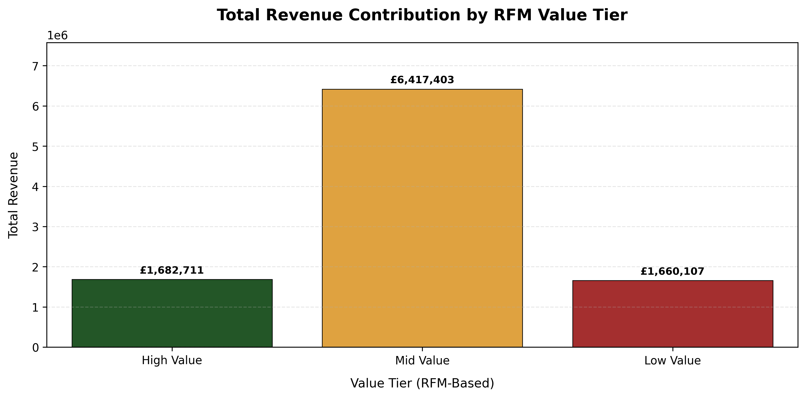

# 🚗 Automobile Sales & Logistics Analytics Platform

**Author:** Hardeep Bamrah  
**Role Focus:** Business Analyst | Commercial Analyst | BI Analyst  
**Domain:** Sales Performance • Logistics Risk • Customer Intelligence  
**Tools:** SQL Server • Python • Power BI • GitHub

---

## Overview

This project is an end-to-end analytics portfolio project built to show how sales, operations, and logistics data can be transformed into decision-ready business intelligence.

The analysis connects:
- revenue performance
- customer value
- order fulfilment reliability
- logistics risk exposure
- product-level operational impact

Instead of reporting isolated metrics, the project brings commercial and operational signals into a single analytical framework that supports better business decisions.

---

## Why This Project Matters

In many organisations, revenue dashboards and operational dashboards are separated. That creates blind spots.

This project combines both views to answer questions such as:
- Are high-revenue customers also exposed to shipping risk?
- Which countries show the highest operational failure rates?
- Which products contribute disproportionately to revenue at risk?
- How concentrated is business performance across products and customer groups?
- Where should teams prioritise retention, logistics intervention, or operational review?

---

## Project Highlights

- Built a full analytics workflow across **SQL, Python, and Power BI**
- Designed a **Bronze → Silver → Gold** data architecture for reusable KPI logic
- Created **executive dashboards** for operational monitoring and country risk analysis
- Applied **RFM segmentation**, clustering, and customer risk analysis in Python
- Translated raw transaction data into **business-ready insights** for commercial and operational teams

---

## Dashboard Preview

### Power BI Executive Dashboard


### Logistics Risk by Country


### Python Analysis – Customer Segmentation


---

## Business Objectives

The project was designed to support the following objectives:

- Identify revenue-critical customers and products
- Measure operational reliability across countries and time
- Detect fulfilment issues before they materially affect revenue
- Quantify revenue concentration and logistics risk exposure
- Build a clear executive view of performance, risk, and business trade-offs

---

## Core Business Questions

- Which customers generate the highest revenue?
- Which countries experience the highest logistics failure rates?
- Which products drive the highest revenue concentration?
- Which high-value customers are exposed to fulfilment risk?
- Which product lines and regions contribute most to operational instability?

---

## Dataset Overview

The project uses automobile sales transaction data transformed into order-level, customer-level, and product-level analytical datasets.

The data includes:
- order dates and fulfilment status
- revenue and pricing information
- product, customer, and country attributes
- shipping and operational outcomes
- behavioural measures such as recency, frequency, and monetary value

---

## Solution Architecture

The project follows a layered analytics design used in real business environments:

```text
Raw Transaction Data
        ↓
Bronze Layer (raw structured tables)
        ↓
Silver Layer (cleaned and standardised business-ready data)
        ↓
Gold Layer (aggregated KPI views and analytical models)
        ↓
Power BI Dashboards + Python Insight Layer
```

### SQL — KPI Engine and Data Modelling

SQL acts as the foundation for business logic and reusable KPI creation.

**Bronze Layer**
- raw transactional structure

**Silver Layer**
- cleaned order dates
- standardised dimensions and status values
- derived pricing and discount metrics
- business-ready columns for downstream analysis

**Gold Layer**
- order-level KPIs
- monthly revenue summaries
- country and product-line risk views
- failure, backlog, and high-risk indicators

### Python — Exploratory and Advanced Analytics

Python is used to explore customer behaviour, validate patterns, and generate advanced analytical segments.

Key work includes:
- RFM segmentation
- customer value tiering
- shipping reliability scoring
- customer value × shipping risk segmentation
- K-Means clustering
- regression-based revenue driver analysis

### Power BI — Decision Support and Storytelling

Power BI is used as the business-facing reporting layer.

It turns SQL-based KPI outputs into interactive, executive-ready dashboards that make commercial and operational insights easy to understand.

---

## KPI Framework

| KPI | Description | Business Use |
|---|---|---|
| Total Revenue | Sum of sales across orders | Tracks commercial performance |
| Total Orders | Distinct order count | Measures demand volume |
| Revenue per Order | Revenue divided by number of orders | Monitors order quality/value |
| Gross Profit Proxy | Estimated margin signal using MSRP vs selling price | Supports pricing and profitability review |
| Failure Rate | Share of failed orders | Measures operational reliability |
| High-Risk Order % | Share of orders with risky fulfilment status | Highlights service risk |
| Revenue Concentration | Share of revenue driven by top products/customers | Identifies dependency risk |
| Revenue at Risk | Revenue exposed to operational issues | Supports intervention prioritisation |

---

## Power BI Dashboard Pages

### 1. Executive Operations Overview
- total revenue and total orders
- revenue per order
- failure rate and high-risk order percentage
- overall operational health snapshot

### 2. Country Risk Deep-Dive
- country-wise logistics risk
- failure and high-risk order patterns
- geographic exposure analysis

### 3. Order Status & Backlog Monitoring
- order status distribution
- backlog and delay monitoring
- early warning indicators for fulfilment issues

### 4. Product / Revenue at Risk Analysis
- revenue concentration
- products contributing disproportionately to risk
- visibility into revenue exposed to operational failures

---

## Key Insights

- A small share of orders and products accounts for a disproportionate share of operational risk
- High-value customers with low shipping reliability represent an important retention risk
- Revenue stability depends not only on sales performance, but also on fulfilment reliability
- Operational issues often appear before revenue decline becomes visible at aggregate level

---

## Business Impact

This project demonstrates how analytics can support:

- targeted retention actions for valuable but high-risk customers
- logistics review for revenue-critical countries and product lines
- better visibility into the trade-off between growth and operational stability
- executive reporting without exposing technical complexity

---

## Tech Stack

- **SQL Server** — data modelling, transformation, KPI logic
- **Python** — Pandas, NumPy, Scikit-Learn for analysis and modelling
- **Power BI** — executive dashboards and interactive reporting
- **Git & GitHub** — version control and portfolio presentation

---

## Repository Structure

```text
automobile-sales-logistics/
│
├── Data/                # Source or prepared datasets
├── python/              # EDA, segmentation, clustering, regression
├── sql/                 # Bronze → Silver → Gold SQL logic
├── PowerBI/             # Power BI report files
├── streamlit/           # Optional app layer
├── screenshots/         # Dashboard preview images
├── app.py               # Streamlit entry point
├── requirements.txt     # Project dependencies
└── README.md
```

---

## Skills Demonstrated

- business and commercial analysis
- sales performance analysis
- logistics risk analysis
- customer segmentation and value analysis
- SQL data modelling and KPI design
- Python-based exploratory and advanced analytics
- dashboard storytelling for decision-makers

---

## How to Use This Repository

1. Review the **README** for business context and project structure  
2. Open the **SQL scripts** to understand the Bronze → Silver → Gold pipeline  
3. Explore the **Python notebooks** for segmentation, clustering, and validation work  
4. Open the **Power BI report** to view the executive dashboards  
5. Use the screenshots section for a quick visual overview of outcomes

---

## Final Note

This project was built to reflect how analytics works in real organisations:

**from raw data → to structured logic → to business decisions**

It demonstrates both technical execution and business thinking across commercial analytics, operations analytics, and executive reporting.

---

## License

MIT License