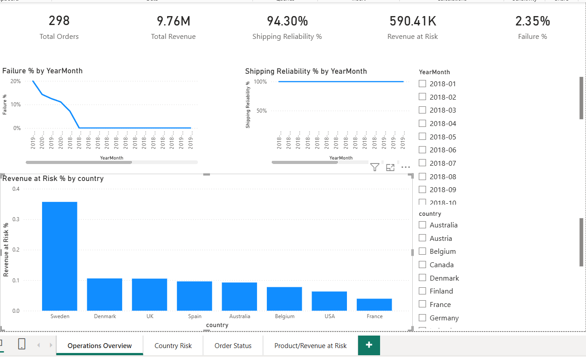
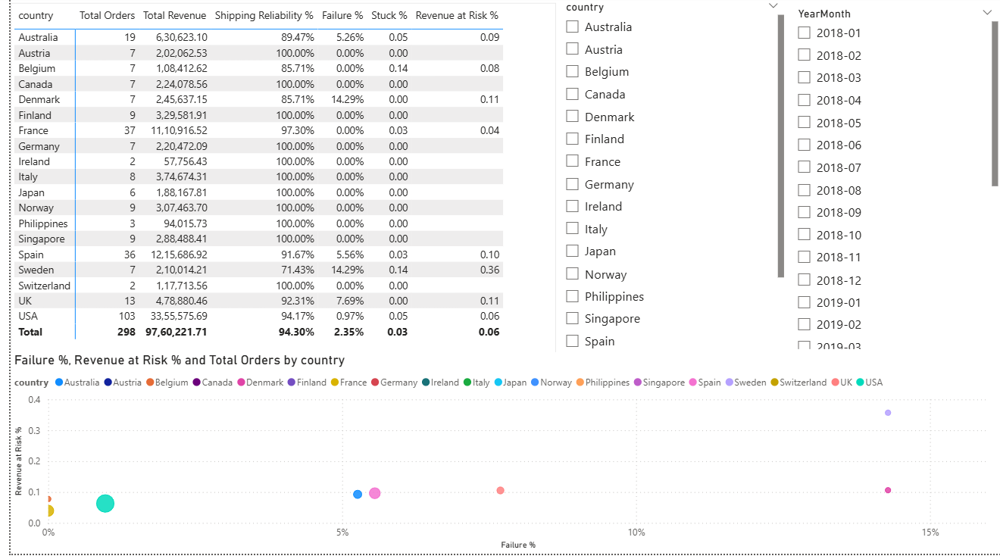
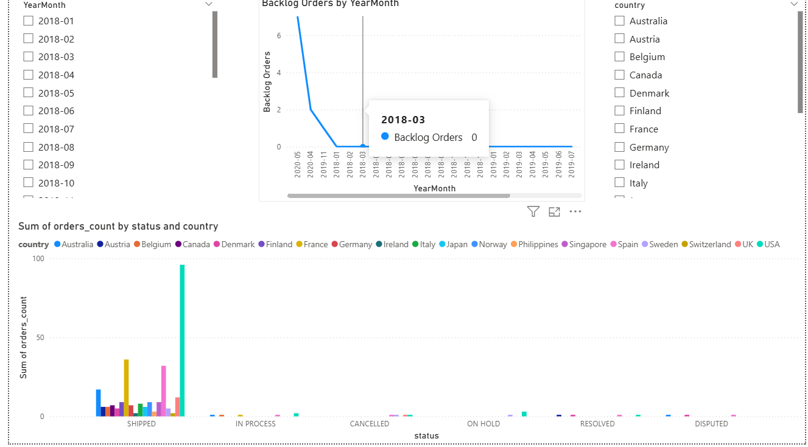
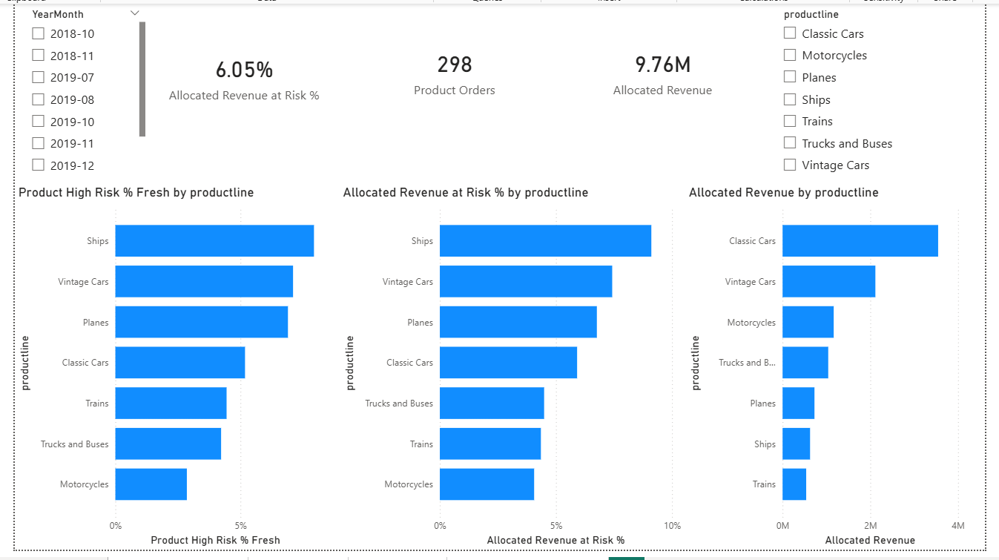
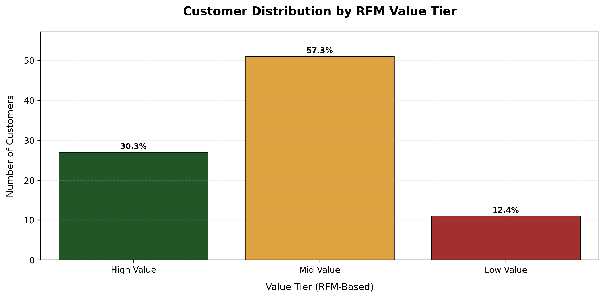
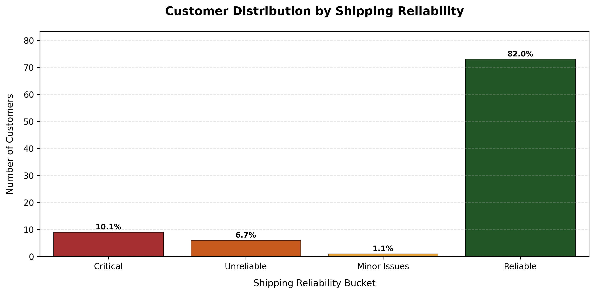
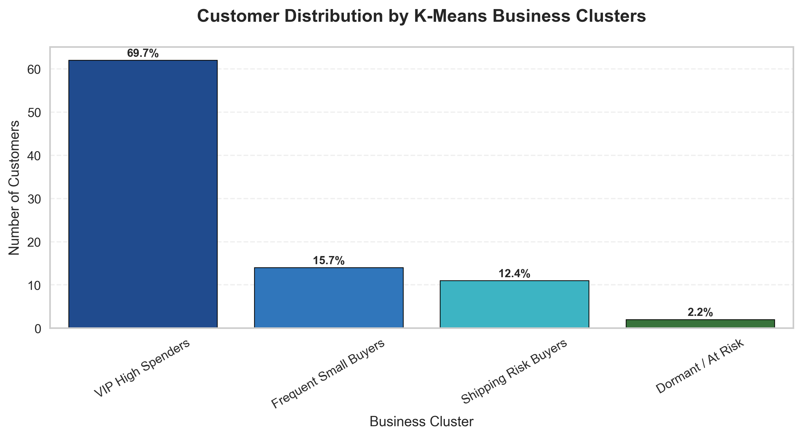
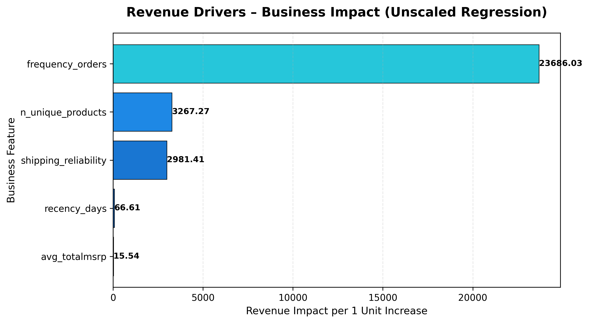

# 🚗 Automobile Sales & Logistics Analytics Platform

**Author:** Hardeep Bamrah  
**Role Focus:** Business Analyst | Commercial Analyst | BI Analyst  
**Domain:** Sales Performance • Logistics Risk • Customer Intelligence  
**Tools:** SQL Server • Python • Power BI • GitHub

---

## Executive Summary

This project combines sales analytics, logistics risk monitoring, customer segmentation, and revenue driver analysis into a single end-to-end analytics workflow.

Instead of reporting revenue in isolation, the project shows how operational reliability, order failures, backlog behaviour, product-line exposure, and customer behaviour affect commercial performance.

The solution was built using:
- **SQL Server** for Bronze → Silver → Gold modelling
- **Python** for RFM segmentation, clustering, regression, and visual analysis
- **Power BI** for executive dashboards and operational reporting

---

## Business Objective

The project was designed to answer practical commercial and operational questions such as:

- Which countries generate the most revenue?
- Which markets are operationally risky despite strong revenue?
- How much revenue is exposed to failures or stuck orders?
- Which product lines combine high revenue with high risk?
- Which customer segments drive the most value?
- What factors are most strongly associated with revenue growth?

---

## Headline Results

### Power BI Executive KPIs
- **Total Orders:** 298
- **Total Revenue:** 9.76M
- **Shipping Reliability:** 94.30%
- **Failure Rate:** 2.35%
- **Revenue at Risk:** 590.41K

These KPIs show that the business is operationally stable overall, but still carries a measurable level of revenue exposure linked to fulfilment and order-risk conditions.

---

## Country-Level Risk Insights

The dashboard compares revenue, operational quality, and exposure by country.

### Key findings
- **USA** is the largest market:
  - **103 orders**
  - **3,355,575.69 revenue**
  - **94.17% shipping reliability**
  - **0.97% failure rate**
- **France** and **Spain** are also major contributors:
  - France: **1,110,916.52 revenue**
  - Spain: **1,215,686.92 revenue**
- **Sweden** stands out as the highest-risk market:
  - **14.29% failure rate**
  - highest visible revenue-at-risk concentration in the dashboard
- Other countries with notable operational exposure include:
  - **Denmark**
  - **UK**
  - **Spain**
  - **Australia**
  - **Belgium**

### Why it matters
This view helps identify markets where commercial scale and operational fragility overlap.  
That makes it easier to prioritise intervention where revenue is most exposed.

---

## Product / Revenue at Risk Insights

The project also breaks risk down at product-line level using revenue allocation logic.

### Headline metrics
- **Allocated Revenue:** 9.76M
- **Allocated Revenue at Risk %:** 6.05%
- **Product Orders:** 298

### Key findings
- **Ships** show the highest operational exposure by product-line risk percentage
- **Vintage Cars** and **Planes** also show elevated revenue-risk patterns
- **Classic Cars** contribute the highest allocated revenue, at roughly **3.6M+**
- **Vintage Cars** contribute around **2.1M**
- The highest-revenue product line is not necessarily the highest-risk one

### Why it matters
This allows decision-makers to distinguish between:
- categories that are commercially important
- categories that are operationally vulnerable

That makes prioritisation more intelligent than simple revenue ranking.

---

## Customer Segmentation Insights

Python was used to build customer value and behaviour segments.

### RFM Value Tier split
- **Mid Value:** 57.3%
- **High Value:** 30.3%
- **Low Value:** 12.4%

### Revenue contribution by segment
- **Mid Value customers:** 6,417,403
- **High Value customers:** 1,682,711
- **Low Value customers:** 1,660,107

### Business meaning
Mid Value customers are the largest group and also the strongest revenue engine.  
This suggests that retention, service quality, and upsell strategies targeted at this group could have the biggest commercial payoff.

---

## Shipping Reliability Segmentation

Customers were also segmented by fulfilment quality.

### Distribution
- **Reliable:** 82.0%
- **Critical:** 10.1%
- **Unreliable:** 6.7%
- **Minor Issues:** 1.1%

### Business meaning
Most customers experience reliable fulfilment, but a meaningful minority falls into risky service buckets.  
This highlights where operational issues may affect customer experience and future commercial performance.

---

## K-Means Business Clusters

Behaviour-based clustering identified four customer groups:

- **VIP High Spenders:** 69.7%
- **Frequent Small Buyers:** 15.7%
- **Shipping Risk Buyers:** 12.4%
- **Dormant / At Risk:** 2.2%

### Business meaning
These clusters support different commercial actions:
- retain and protect VIP spenders
- grow frequent small buyers
- address service issues for shipping-risk buyers
- reactivate dormant accounts selectively

---

## Revenue Driver Analysis

A regression model was used to estimate which factors are most strongly associated with revenue.

### Model performance
- **R² Score:** 0.971
- **RMSE:** 23,200.08

### Strongest drivers
- **frequency_orders:** 23,686.03
- **n_unique_products:** 3,267.27
- **shipping_reliability:** 2,981.41
- **recency_days:** 66.61
- **avg_totalmsrp:** 15.54

### Business meaning
The strongest revenue signal comes from **repeat order behaviour**, followed by **product breadth** and **shipping reliability**.

This is one of the most important findings in the project:
**shipping reliability is not only an operations metric — it also has commercial relevance.**

---

## SQL Data Modelling

The SQL layer was built using a **Bronze → Silver → Gold** framework.

### Bronze
Raw source ingestion.

### Silver
Cleaning and standardisation, including:
- date conversion
- text standardisation
- derived month fields
- discount percentage
- profit proxy

### Gold
Business-ready views for:
- order performance
- monthly revenue
- country operational KPIs
- product-line operational KPIs
- revenue-at-risk analysis

### Important modelling logic
Statuses such as:
- SHIPPED
- ON HOLD
- IN PROCESS
- CANCELLED
- DISPUTED

were transformed into business flags such as:
- **Failure Flag**
- **High-Risk Flag**
- **Stuck Flag**

This allowed the project to quantify:
- failure rate
- stuck order rate
- high-risk order share
- revenue at risk

### Revenue allocation logic
A bridge table with allocation weights was used to distribute order revenue across multiple product lines and avoid double counting.

That makes the product-line analysis much more reliable.

---

## Power BI Dashboard Structure

The Power BI report is organised into four pages:

### 1. Operations Overview
Tracks:
- Total Orders
- Total Revenue
- Shipping Reliability %
- Failure %
- Revenue at Risk
- monthly KPI trends

### 2. Country Risk
Tracks:
- order volume by country
- revenue by country
- failure %
- stuck %
- revenue-at-risk %

### 3. Order Status Monitoring
Tracks:
- backlog trend
- order status distribution
- fulfilment behaviour over time

### 4. Product / Revenue at Risk
Tracks:
- product-line risk %
- allocated revenue
- allocated revenue at risk
- product-level exposure analysis

---

## Dashboard Preview

### Operations Overview


### Country Risk


### Order Status


### Product / Revenue at Risk


### RFM Value Tier Distribution


### Revenue Contribution by Value Tier


### Shipping Reliability Segmentation


### K-Means Business Clusters


### Revenue Drivers


---

## Repository Structure

```text
Automobile-Sales-Logistics/
│
├── Data/
├── python/
│   └── Notebooks/
├── SQL/
├── PowerBI/
├── screenshots/
├── streamlit/
├── app.py
├── requirements.txt
└── README.md